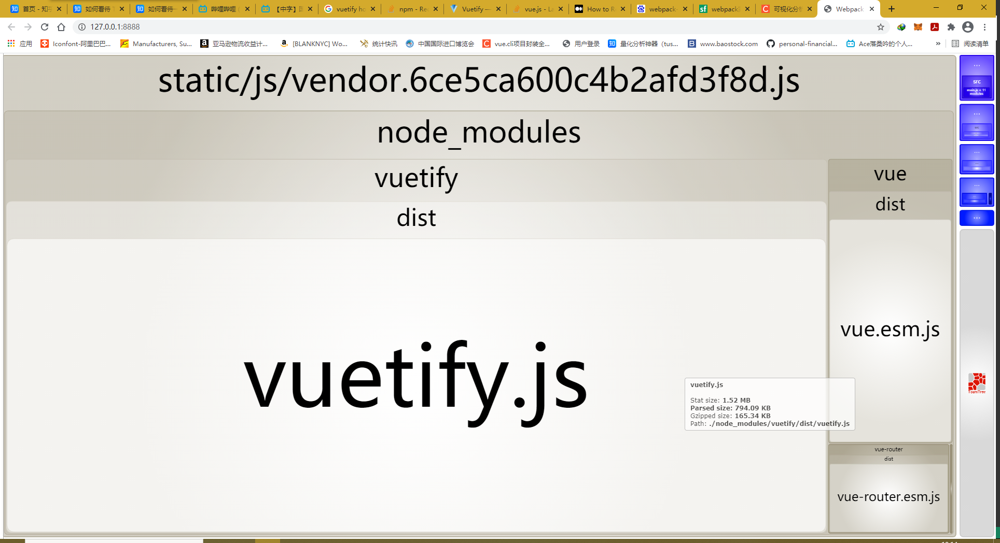

# garment

> A Vue.js project

## Build Setup

``` bash
# install dependencies
npm install

# serve with hot reload at localhost:8080
npm run dev

# build for production with minification
npm run build

# build for production and view the bundle analyzer report
npm run build --report
```

For a detailed explanation on how things work, check out the [guide](http://vuejs-templates.github.io/webpack/) and [docs for vue-loader](http://vuejs.github.io/vue-loader).


## vue首次加载速度慢
1. 去编译文件中的map文件。主要作用是线上调试代码。
```javascript
//config/index.js
productionSourceMap :false
```
2. vue-router路由懒加载.
    + 懒加载即组件的延迟加载，通常vue的页面在运行后进入都会有一个默认的页面，而其他页面只有在点击后才需要加载出来。使用懒加载可以将页面中的资源划分为多份，从而减少第一次加载的时候耗时。
```javascript
//非懒加载
export default new Router({
  routes: [
    {
      path: '/',
      name: 'Home',
      component: Home
    },
    {
      path:'/Texttile',
      name:'Texttile',
      component:()=>import('@/views/Texttile.vue')
    },
    {
      path:'/Contact',
      name:'Contact',
      component:()=>import('@/views/Contact.vue')
    }
  ]
})
//懒加载
const Home=()=>import('@/views/Home.vue')
const Texttile=()=>import('@/views/Texttile.vue')
const Contact=()=>import('@/views/Contact.vue')
export default new Router({
  routes: [
    {
      path: '/',
      name: 'Home',
      component: Home
    },
    {
      path:'/Texttile',
      name:'Texttile',
      component:Texttile,
    },
    {
      path:'/Contact',
      name:'Contact',
      component:Contact,
    }
  ]
})

```
3. vendor.js文件过大
+ 造成过大的原因是因为在main.js导入第三库太多时,webpack合并js时生成了vendor.js(我们习惯把第三方库放在vendor里面)造成的.如下图在main.js引用element-ui等第三方库。后果就是你的服务器端的js文件越大则用户加载页面的时间会越长(因为所需下载js的时间越久)
+ 解决方案:采用cdn加速去从别的服务器上加载第三方库而非自己的服务器，这样就会快很多.并且能节省自己服务器的带宽。
+ 
+ 可以看到vuetify.js占据了主要的打包空间
```javascript
//先修改 webpack.base.conf.js


```
```html
//再在index.html中引入CDN
   <!-- CDN 替代 vuetify -->
    <link href="https://fonts.googleapis.com/css?family=Roboto:100,300,400,500,700,900" rel="stylesheet">
    <link href="https://cdn.jsdelivr.net/npm/@mdi/font@4.x/css/materialdesignicons.min.css" rel="stylesheet">
    <link href="https://cdn.jsdelivr.net/npm/vuetify@2.x/dist/vuetify.min.css" rel="stylesheet">

<!-- CDN 替代vue -->
<script src="https://cdn.jsdelivr.net/npm/vue@2.x/dist/vue.js"></script>
<script src="https://cdn.jsdelivr.net/npm/vuetify@2.x/dist/vuetify.js"></script>
```


---
### 2021_4_6-待办事务
1. 站点管理 站长工具认证
2. lazy 懒加载 瘦身 完成上面的vendor.js 优化CDN
3. 修改网站图片加载 增加lazy
4. 先完成上面三项吧 欧拉欧拉欧拉欧拉欧拉欧拉欧拉欧拉欧拉
